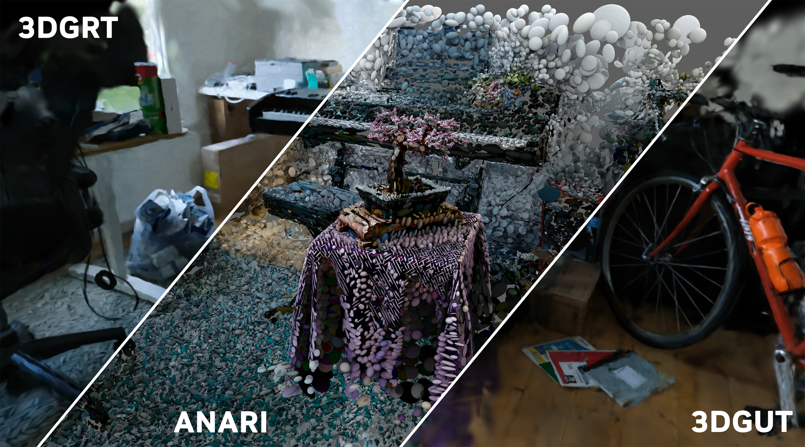

# 3DGRUT VIS

3DGRUT VIS is a high-performance 3D Gaussian Splatting visualization engine tightly integrated with the [3dgrut](https://github.com/nv-tlabs/3dgrut) repository, leveraging [ANARI](https://github.com/KhronosGroup/ANARI-SDK) and [VisRTX](https://github.com/NVIDIA/VisRTX) rendering backends. It provides both native C++ interactive and headless viewers, as well as Python bindings and a flexible [Polyscope](https://polyscope.run/)-based interactive viewer.



## Features

- **Interactive Viewer**: High-performance C++ viewer using GLFW and ImGui for real-time 3D navigation and parameter tuning.
- **Headless Command Line Viewer**: C++ application to render 3D Gaussian scenes to PNG files directly.
- **Polyscope Viewer (Python)**: A unified Python viewer that allows seamless on-the-fly switching between multiple rendering backends (`anari`, `3dgrt`, `3dgut`).
- **CUDA-GL Interop**: Zero-copy display path on supported devices for maximum performance.
- **Python Bindings**: Exposes the `GaussianRendererCore` through `pybind11` for custom integration.

## Installation

### Prerequisites
- CMake >= 3.17
- OptiX SDK (Downloaded automatically if not found locally)
- CUDA Toolkit (Optional, but required for `3dgrt`/`3dgut` backends and CUDA-GL interop)

### Python Package (Recommended)

You can install the Python package, which automatically builds the C++ core and exposes the Python bindings. 

Using `uv` (recommended):

```bash
uv sync
```

Or using `pip`:

```bash
pip install .
```

To include the dependencies for the Polyscope interactive viewer:

```bash
pip install .[polyscope]
```

### C++ Standalone Build

To build the native viewers directly, you can use the provided build scripts:

**Linux / macOS:**

```bash
./build_visualization.sh
```

**Windows:**

```powershell
.\build_visualization.ps1
```

Alternatively, you can build manually with CMake:

```bash
mkdir build && cd build
cmake .. -DCMAKE_BUILD_TYPE=Release
cmake --build . --parallel
```

## Usage

### Polyscope Viewer (Python)

The Polyscope viewer provides a rich GUI and allows switching rendering backends dynamically:

```bash
polyscope-viewer /path/to/scene.ply [--renderer anari|3dgrt|3dgut]
```

*(Note: `3dgrt` and `3dgut` backends require the `threedgrut` repository to be installed).*

### Interactive Viewer (C++)

The native interactive viewer offers maximum performance:

```bash
interactive-viewer /path/to/scene.ply [options]
```

**Controls:**

- **LMB drag**: Orbit
- **RMB drag**: Pan
- **Scroll**: Zoom
- **W/S**: Dolly forward/backward
- **A/D**: Strafe left/right
- **Q/E**: Orbit pitch (up/down)
- **G**: Toggle GUI
- **S**: Save screenshot
- **Escape**: Quit

### Headless Renderer (C++)

Render directly to an image file:

```bash
gaussian-viewer /path/to/scene.ply [options]
```

Outputs `gaussian_viewer.png` by default.

## Project Structure

- `src/` - Core C++ implementation, containing the `GaussianRendererCore`, `pybind11` wrappers, and standalone viewers.
- `gaussian_viewer/` - Python package containing the `polyscope_viewer` and launcher scripts.
- `CMakeLists.txt` - CMake build system configuring ANARI, VisRTX, and OptiX dependencies.
- `pyproject.toml` - Python packaging configuration using `scikit-build-core`.